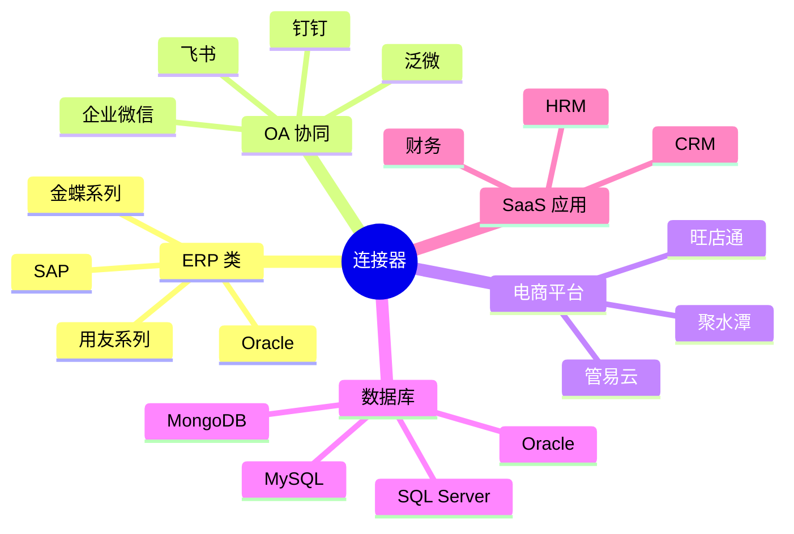

# 连接器

轻易云 iPaaS 提供丰富的预置连接器，支持 500+ 主流企业应用系统。

## 连接器分类

## 目录

### ERP 类
- [ERP 连接器概览](./connectors/erp)
- [金蝶星瀚](connectors/erp/kingdee-galaxystar.md)
- [金蝶云星空](connectors/erp/kingdee-cloud-galaxy.md)
- [金蝶云苍穹](connectors/erp/kingdee-cloud-cosmos.md)
- [金蝶云星辰](connectors/erp/kingdee-cloud-star.md)
- [金蝶 KIS](connectors/erp/kingdee-kis.md)
- [金蝶 EAS](connectors/erp/kingdee-eas.md)
- [金蝶 K3 WISE](connectors/erp/kingdee-k3wise.md)
- [用友 NC](connectors/erp/yonyou-nc.md)
- [用友 NC Cloud](connectors/erp/yonyou-nc-cloud.md)
- [用友 U8+](connectors/erp/yonyou-u8.md)
- [用友 U9](connectors/erp/yonyou-u9.md)
- [用友 YonSuite](connectors/erp/yonyou-yonsuite.md)
- [用友 BIP](connectors/erp/yonyou-bip.md)
- [畅捷通](connectors/erp/chanjet.md)
- [畅捷通 T+](connectors/erp/chanjet-tplus.md)
- [畅捷通好会计](connectors/erp/chanjet-accounting.md)
- [Oracle EBS](connectors/erp/oracle-ebs.md)

### OA / 协同类
- [OA 连接器概览](./connectors/oa)
- [钉钉](connectors/oa/dingtalk.md)
- [飞书](connectors/oa/feishu.md)
- [企业微信](connectors/oa/wecom.md)
- [泛微 E9](connectors/oa/fanwei.md)
- [泛微 e-cology](connectors/oa/weaver-ecology.md)
- [泛微 e-office](connectors/oa/weaver-eoffice.md)
- [蓝凌 EKP](connectors/oa/landray.md)
- [致远 OA](connectors/oa/seeyon-oa.md)
- [致远 A8](connectors/oa/seeyon-a8.md)
- [道一云](connectors/oa/daoyiyun.md)
- [氚云](connectors/oa/h3yun.md)
- [简道云](connectors/oa/jiandaoyun.md)
- [汇联易](connectors/oa/huilianyi.md)

### 电商 / WMS 类
- [电商连接器概览](./connectors/ecommerce)
- [旺店通](connectors/ecommerce/wangdian.md)
- [聚水潭](connectors/ecommerce/jushuitan.md)
- [万里牛](connectors/ecommerce/maliniu.md)
- [管易云](connectors/ecommerce/guanyi.md)
- [易仓](connectors/ecommerce/ecang.md)
- [快麦](connectors/ecommerce/kuaimai.md)
- [网店管家](connectors/ecommerce/wangdianguanjia.md)
- [网店精灵](connectors/ecommerce/wangdianjingling.md)
- [班牛](connectors/ecommerce/banniu.md)

### 数据库类
- [数据库连接器概览](./connectors/database)
- [MySQL](connectors/database/mysql.md)
- [PostgreSQL](connectors/database/postgresql.md)
- [Oracle](connectors/database/oracle.md)
- [SQL Server](connectors/database/sqlserver.md)
- [MongoDB](connectors/database/mongodb.md)
- [Redis](connectors/database/redis.md)
- [Elasticsearch](connectors/database/elasticsearch.md)
- [ClickHouse](connectors/database/clickhouse.md)
- [Kafka](connectors/database/kafka.md)

### CRM / SaaS 类
- [SaaS 连接器概览](./connectors/saas)
- [销帮帮](connectors/saas/xiaobangbang.md)
- [纷享销客](connectors/saas/fenxiangxiaoke.md)
- [销售易](connectors/saas/xiaoshouyi.md)
- [Moka](connectors/saas/moka.md)
- [北森](connectors/saas/beisen.md)
- [Salesforce](connectors/saas/salesforce.md)
- [HubSpot](connectors/saas/hubspot.md)
- [WordPress](connectors/saas/wordpress.md)
- [管家婆](connectors/saas/wsgjp.md)
- [指掌天下](connectors/saas/zhizhangtianxia.md)
