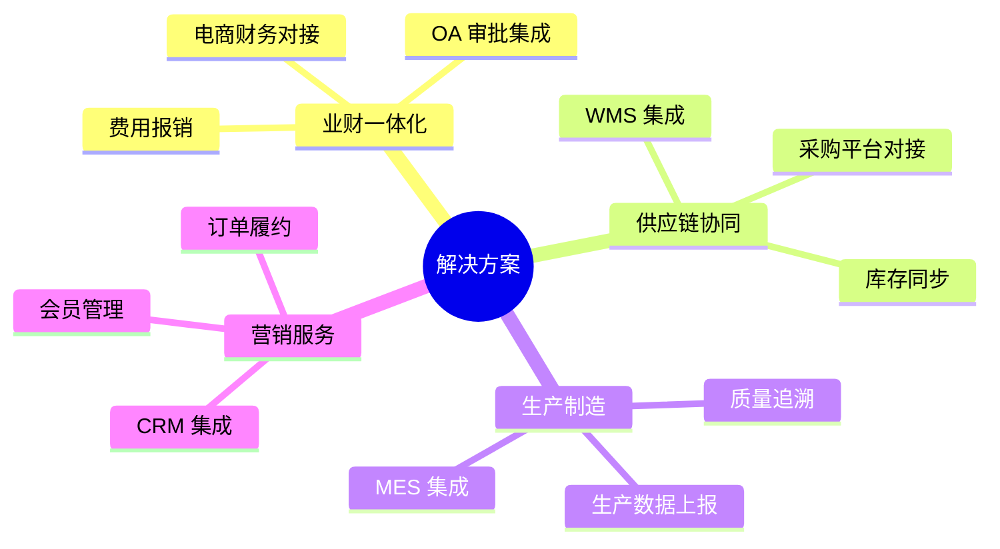

# 解决方案

轻易云 iPaaS 针对各行业和业务场景提供专业的集成解决方案。

## 场景分类

## 目录

- [解决方案概览](solutions/README.md)
- [央国企采购平台对接](solutions/government-procurement.md)
- [MES 与 ERP 集成方案](solutions/mes-erp.md)
- [CRM 集成方案](solutions/crm-integration.md)
- [金蝶钉钉审批集成](solutions/kingdee-dingtalk-approval.md)
- [金蝶飞书审批集成](solutions/kingdee-feishu-approval.md)
- [金蝶聚水潭集成](solutions/kingdee-jushuitan.md)
- [金蝶旺店通集成](solutions/kingdee-wangdian.md)
- [用友旺店通集成](solutions/yonyou-wangdian.md)
- [电商数据中台集成](solutions/ecommerce-data-hub.md)
- [OA 费控集成方案](solutions/oa-finance.md)

### 行业方案
- [制造业](solutions/manufacturing.md)
- [零售业](solutions/retail.md)
- [跨境电商](solutions/crossborder-ecommerce.md)
- [物流仓储](solutions/logistics.md)
- [医药健康](solutions/healthcare.md)
- [教育培训](solutions/education.md)
- [金融服务](solutions/finance.md)
- [SaaS 企业](solutions/saas.md)
